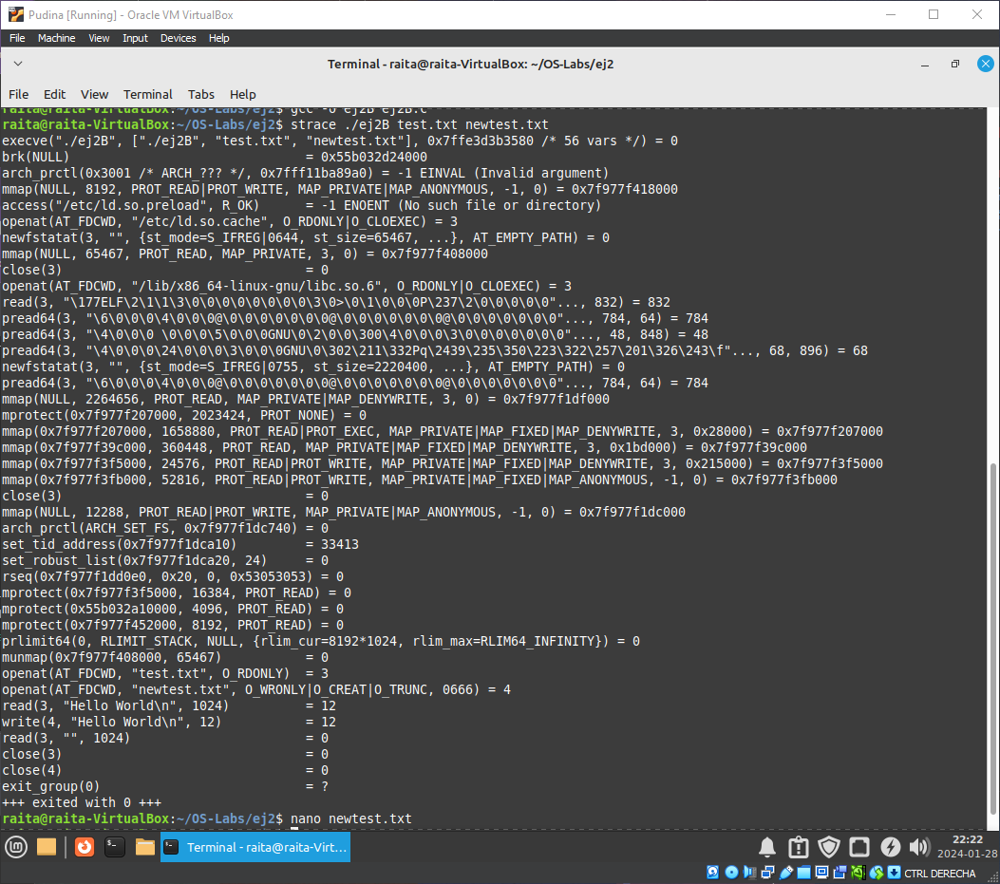

# Universidad del Valle de Guatemala  Sistemas Operativos   Adrian Fulladolsa - 21592

## Laboratorio 1
Descripción: en este laboratorio se realizarán ejercicios para reforzar los conceptos de llamadas de
sistema e introducir de manera práctica el concepto de proceso. Estos ejercicios requerirán programación
en C. Se explicarán algunas instrucciones y métodos de trabajo usados con C, pero se recomienda
profundizar e investigar sobre el lenguaje puesto que lo seguiremos usando durante el curso.

Ejercicio 1

    <ul>

<li>
 
A

         Al ejecutar el programa compilado:   <code>ej1A</code>  se obtiene lo siguiente:
 
        Hello World!
        31522

</li>
    <li>
 
B

       El ejecutar el programa compilado: <code>ej1B</code> se obtiene lo siguiente:
        
        31524
        Hello World!
        31525
        Hello World!
        31524

</li>
    <li>
 
C

    <ul>
    <li>Compile el primer programa y ejecútelo varias veces. Responda: ¿por qué aparecen números diferentes cada vez? 

R/ 

    
Cada ejecución del programa <code>ej1A</code> crea un nuevo proceso al cual el Sistema Operativo le asigna un <i>PID</i> único. 

        
</li>
    <li>
    Proceda a compilar el segundo programa y ejecútelo una vez. ¿Por qué aparecen dos números distintos a pesar de que estamos ejecutando un único programa?

R/ 

    Al ejecutar el segundo programa se obtienen un total de tres números, en mi caso el primero y el tercero son el mismo número mientras que el segundo es distinto. 
    Esto se debe al uso de la función <code>fork()</code> la cual crea un proceso hijo el cual ejecuta de manera concurrente la instrucción siguiente al llamado de la función.
    Dado esto, podemos entender que uno de los números es el <i>PID</i> del proceso padre y el otro número es el <i>PID</i> del proceso hijo.
    

</li>
    <li>¿Por qué el primer y el segundo números son iguales?

R/ 

    En mi caso, el primer y el tercer número son iguales y el segundo es distinto.
    Este comportamiento se debe a la ejecución concurrente del proceso padre y el proceso hijo.
     El primer número mostrado por la función printf del else muestra el <i>PID</i> del proceso padre.
     El segundo número mostrado por la función printf ejecutada bajo la función execl es ejecutada 
    dentro del proceso hijo por lo que tiene un <i>PID</i> con un número mayor al del proceso padre.
     Por último, el tercer número mostrado es el retorno al proceso padre para que dentro de este 
    se ejecute el execl que nos muestra el primer <i>PID</i>.

</li>

<li>En la terminal, ejecute el comando top (que despliega el top de procesos en cuanto a consumo de CPU) y note cuál es el primer proceso en la lista (con identificador 1). ¿Para qué sirve este proceso?

R/ 

    El proceso con el <i>PID</i> 1 corresponde al proceso <code>systemd</code>, este proceso el el encargado de manejar el sistema y los servicios de Linux. Sus funciones incluyen las de manejar los procesos del usuario y el bootstrap del espacio de usuario.

</li>
    </ul>
    

Ejercicio 2

    <ul>
        <li>
 
A

            Investigue acerca de las llamadas a sistema open(), close(), read()y write(). Agregue a su documento una breve explicación de su investigación
            <ul>
                <li>

<code>open()</code>

                    La función <code>open()</code> se utiliza para abrir un archivo u opcionalmente crearlo si no ha sido creado. Esta función toma la dirección del archivo, un parametro del modo de apertura y un parametro de la manera que se maneja la creación del archivo. 
                     El retorno de esta función es una descripción del archivo el cual es un valor entero no-negativo. Un ejemplo del uso de esta función es:
                     <code>open(filename, O_WRONLY|O_CREAT|O_TRUNC)</code>
                     Los parametros se van a interpretar de la siguiente manera:
                    <ul>
                        <li><b>filename</b>: Es la direción con el nombre del archivo</li>
                        <li><b>O_WRONLY</b>: Es una bandera que indica que el archivo es unicamente de escritura</li>
                        <li><b>O_CREAT</b>: Es una bandera que indica que el archivo será creado si este no existe</li>
                        <li><b>O_TRUNC</b>: Es una bandera que indica si el archivo ya existia, este será truncado a cero eliminando todo su contenido</li>
                    </ul>
               
</li>
                <li>

<code>close()</code>

                    La función <code>close()</code> se utiliza para cerrar el descriptor de un archivo de manera que este pueda ser reutilizado ya que se eliminan todos los registros que eran asociados al archivo 
                     El retorno de esta función es un cero si el proceso es exitoso o un -1 si es encuentra un error. Un ejemplo del uso de esta función es:
                     <code>close(12231)</code>
                     Los parametros se van a interpretar de la siguiente manera:
                    <ul>
                        <li><b>12231</b>: Este es el descriptor del archivo que sera parado</li>
                    </ul>
                
</li>
                <li>

<code>read()</code>

                    La función <code>read()</code> se utiliza para leer los datos que se encuentran en un archivo. Se toman los parametros del descriptor del archivo, el puntero del buffer donde se van a almacenar los datos que serán leídos y el número de bytes que serán leídos. 
                     El retorno de esta función es la cantidad de bytes que fueron leídos y se aumenta la posición del archivo por uno, en caso que se retornen una cantidad menor a la esperada puede ser por falta de datos o la lectura fue interrumpida, si se encuentra un error se retorna un -1. Un ejemplo del uso de esta función es:
                     <code>read(12231, *buffer, 1024)</code>
                     Los parametros se van a interpretar de la siguiente manera:
                    <ul>
                        <li><b>12231</b>: El descriptor del archivo</li>
                        <li><b>*buffer</b>: Es el puntero, indicado por el * al inicio, del buffer donde serán almacenados los datos leídos</li>
                        <li><b>1024</b>: Representa que se espera que sean leídos un total de 1024 bytes de información que serán almacenados en el buffer.</li>
                    </ul>
                
</li>
                <li>

<code>write()</code>

                    La función <code>write()</code> se utiliza para escribir datos en un descriptor de archivo. Esta función toma como parámetros el descriptor de archivo, el buffer de datos que serán escritos y la cantidad de bytes que serán escritos 
                     El retorno de esta función es el total de bytes que fueron escritos o el valor -1 al encontrar error. Un ejemplo del uso de esta función es:
                     <code>write(12231, *buffer, 1024)</code>
                     Los parametros se van a interpretar de la siguiente manera:
                    <ul>
                        <li><b>12231</b>: El descriptor del archivo</li>
                        <li><b>*buffer</b>: Es el puntero, indicado por el * al inicio, del buffer donde serán leídos los datos a escribir en el archivo</li>
                        <li><b>1024</b>: Representa que se espera que sean escritos un total de 1024 bytes de información .</li>
                    </ul>
                
</li>
            </ul>
            

        </li>
        <li>

B

            La ejecución del comando en Terminal:  <code>./ej2 test.txt newtest.txt</code>   Resulta en la creacion del archivo newtest.txt en el cual fue colocada la información del archivo test.txt, el cual contiene la frase: <i>Hello World</i>. Además se incluyen en el nuevo archivo algunos metadatos del archivo original.
        
</li>
        <li>
 
C

            La ejecución del comando  <code>sudo apt-get install strace</code>  Resulta en un mensaje de retorno que ya ha sido instalado. Supongo que el kernel Linux que utilizo, <em>Linux Mint Xfce 21.3</em> ya incluye este paquete de utilidad o fue instalado en algún comando realizado anteriormente.
        
</li>
        <li>
 
D

              
            <ul>
                <li>Observe el resultado desplegado. ¿Por qué la primera llamada que aparece es execve?
                    

R/

                    La función execve es la función que ejecuta un programa al cual se le es referido por un
                    nombre de ruta. Esta función especificamente hace que el programa que se este ejecutando 
                    sea reemplazado con el nuevo programa e instancias nuevas de datos necesarios para la 
                    ejecución.
                    

                </li>
                <li>Ubique las llamadas de sistema realizadas por usted. ¿Qué significan los resultados (números que están luego del signo ‘=’)?
                    

R/

                    Los resultados identificados por el símbolo ‘=’ en las llamadas al sistema que realiza mi
                    programa responden al retorno de cada llamada. Los resultados obtenidos por las llamadas
                    al sistema que yo hice son las siguientes:
                    <ol>
                        <li><code>open("test.txt", O_RDONLY)</code> tiene de resultado un 3, correspondiente al descriptor de archivo del archivo <i>test.txt</i></li>
                        <li><code>open("newtest.txt", O_WRONLY |O_CREAT|O_TRUNC, 0666)</code> tiene de resultado un 4, correspondiente al descriptor de archivo del archivo recien creado o truncado <i>newtest.txt</i></li>
                        <li><code>read(3,"Hello World/n", 1024)</code></li> tiene el resultado de un 12, esto significa que fueron leidos un total de 12 bytes del archivo <i>test.txt</i>.</li>
                        <li><code>write(4,"Hello World\n\", 12)</code></li> tiene el resultado de un 12, esto significa que fueron escritos un total de 12 bytes en el archivo <i>newtest.txt</i>.</li>
                        <li><code>read(3, "", 1024)</code> tiene de resultado un 0, esto indica que terminó de ser leído el archivo.</li>
                        <li><code>close(3)</code> termina el descriptor de archivo 3 correspondiente a <i>test.txt</i></li>
                        <li><code>close(4)</code> termina el descriptor de archivo 4 correspondiente a <i>newtest.txt</i></li>
                    

                </li>
                <li>¿Por qué entre las llamadas realizadas por usted hay un read vacío?
                    

R/

                    Esto se debe al funcionamiento del llamado a sistema <code>read()</code>, este se dio ya que despues del primer <code>read()</code> fueron leídos todos los bytes del archivo <i>test.txt</i> y el puntero fue movido por uno despues del fin de la lectura anterior, entonces al realizar el segundo <code>read()</code> ya se encontraba al final del archivo.
                    

                </li>
                <li>Identifique tres servicios distintos provistos por el sistema operativo en este strace. Liste y explique brevemente las llamadas a sistema que corresponden a los servicios identificados (puede incluir read, write, open o close que el sistema haga por usted, no los que usted haya producido directamente con su programa)
                    

R/

                    <ul>
                        <li><code>mmap</code>: Este servicio crea un nuevo mapeo en el espacio de dirección virtual del proceso.</li>
                        <li><code>rseq</code>: Este servicio, tambien llamado <b>Restartable sequence</b> es utilizado por Linux para ejecutar codigo del nivel de usuario realizar operacions en datos del cpu</li>
                        <li><code>prlimit</code>: Este servicio intenta obtener y/o modificar los limites de un proceso dado su PID.</li>
                    </ul>
                    

                </li>
            </ul>
        
</li>
    </ul>

Ejercicio 3

    <ul>
        <li>
 
A

        
</li>
        <li>
 
B

        
</li>
        <li>
 
C

        
</li>
        <li>
 
D

        
</li>
        <li>
 
E

        
</li>
        <li>
 
F

        
</li>
        <li>
 
E

        
</li>
        <li>
 
G

        
</li>
        <li>
 
H

        
</li>
    </ul>

